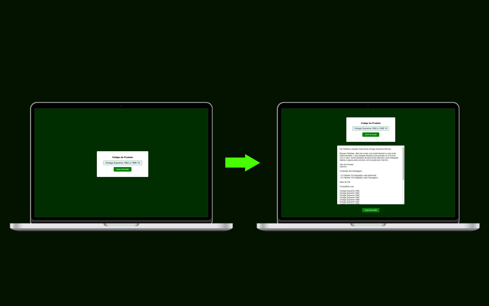

<h1 align="center">Gerador de Descrição</h1>

  

  

## 💻 Projeto

Meu projeto pessoal é uma ferramenta que desenvolvi usando tecnologias web como HTML, CSS e JavaScript. Com esta criação, você pode gerar descrições completas a partir de códigos abreviados, aprimorando significativamente seu desempenho e velocidade na criação de anúncios.

- [Acesse o projeto](https://gerador-descricao.vercel.app/)

## 🚀 Tecnologias

Esse projeto foi desenvolvido com as seguintes tecnologias:

- HTML e CSS
- Git e Github
- Vercel